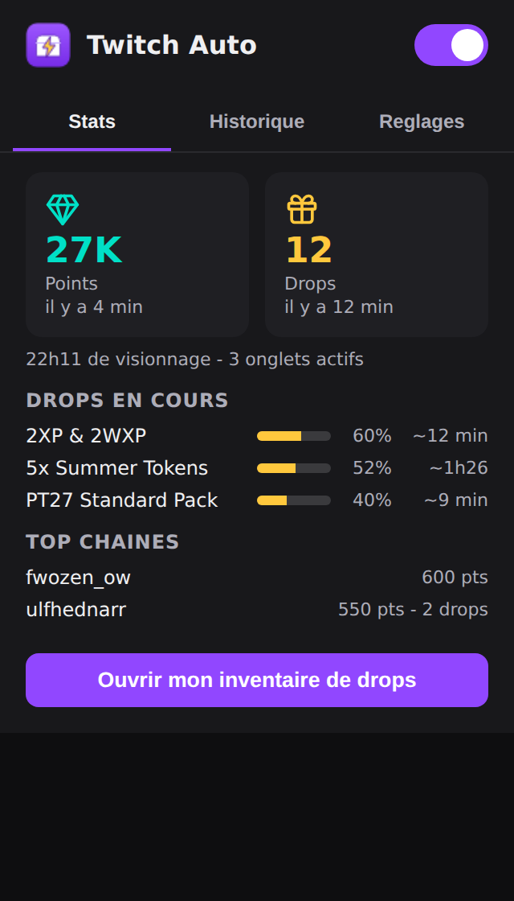

# Twitch Auto

Extension Chrome (Manifest V3) qui automatise Twitch : auto-claim des **points de chaine** et des **drops**, **farming multi-onglets** en arriere-plan, reload auto du player, et de nombreuses aides AFK. Le tout dans un popup clair a 3 onglets.

> Usage **personnel**. Extension chargee en mode developpeur (non publiee sur le Chrome Web Store).

## Fonctionnalites

- **Points de chaine** : reclame les coffres bonus automatiquement (le gain reel est comptabilise).
- **Drops** : reclamation auto via l'inventaire ET via le bandeau qui apparait sur un stream.
- **Farming multi-onglets** : les drops progressent sur TOUS les onglets ouverts en parallele (pas seulement l'onglet actif), et les videos de fond ne se mettent plus en pause.
- **Reload auto** du player en cas d'erreur (avec garde anti-boucle).
- **Qualite mini** (160p) et **mute** sur les onglets en arriere-plan, **anti-AFK** (gates "toujours la" / contenu sensible), **anti-pause**.
- **Suivi** : temps de visionnage, onglets actifs, drops en cours avec % et **temps restant estime (ETA)**, stats par chaine, historique.
- **Notifications**, **export** de l'historique, **auto-MAJ**, **inventaire auto**, **auto-switch** vers une chaine de repli.

## Installation

1. Telecharger la derniere version : [Releases](https://github.com/Guyon-Informatique-Web/twitch-auto/releases/latest) (decompresser le ZIP), ou cloner ce depot.
2. Ouvrir `chrome://extensions`.
3. Activer le **Mode developpeur** (en haut a droite).
4. Cliquer **"Charger l'extension non empaquetee"** et selectionner le dossier de l'extension.
5. Epingler l'icone, ouvrir Twitch : c'est actif.

## Utilisation

- Clic sur l'icone -> popup a 3 onglets : **Stats** (compteurs, suivi, drops en cours), **Historique**, **Reglages** (active/desactive chaque fonction).
- **Pour farmer les drops sans rien faire** : garde un onglet ouvert sur `twitch.tv/drops/inventory` **en arriere-plan**. L'extension le rafraichit toute seule et reclame les drops termines. (Ou active l'option "Inventaire auto" qui le fait pour toi.)
- Les drops progressent sur tous tes onglets de stream ouverts en parallele.

## Mises a jour

L'extension verifie automatiquement s'il existe une version plus recente et l'affiche dans le popup (banniere + bouton "Telecharger la MAJ"). Pour mettre a jour : telecharger la derniere release, remplacer le dossier, puis recharger l'extension sur `chrome://extensions`.

Grace a la cle d'ID epinglee dans le manifest, le stockage (compteurs, historique) est conserve d'une mise a jour a l'autre.

## Developpement et maintenance

- **Sans build** : HTML/CSS/JS vanilla, chargeable tel quel.
- **Tous les selecteurs Twitch** sont centralises dans `src/content/selectors.js` : c'est le seul fichier a corriger quand Twitch change son interface.
- **Diagnostic** : le bouton "Tester les selecteurs" (onglet Reglages), lance sur une page Twitch, indique ce que l'extension trouve.
- **Tests** des fonctions pures : `node test/util.test.js`.

## Licence

Usage **personnel et gratuit** autorise. Il est **interdit** de modifier, redistribuer, heberger ailleurs ou revendre ce logiciel sans accord ecrit de l'auteur. Voir [LICENSE](LICENSE). Tous droits reserves - Valentin Guyon (Guyon Informatique & Web).

## Credits

Icones : [Lucide](https://lucide.dev) / [Feather](https://feathericons.com) (licences ISC / MIT).

## Avertissement

L'automatisation de Twitch (auto-claim de points/drops) est dans une zone grise des conditions d'utilisation de Twitch. Cet outil agit par simulation de clics dans la page (pas d'API privee), ce qui limite le risque, mais sans aucune garantie. Utilisation a vos propres risques.

---

Historique des versions : [CHANGELOG.md](CHANGELOG.md)
