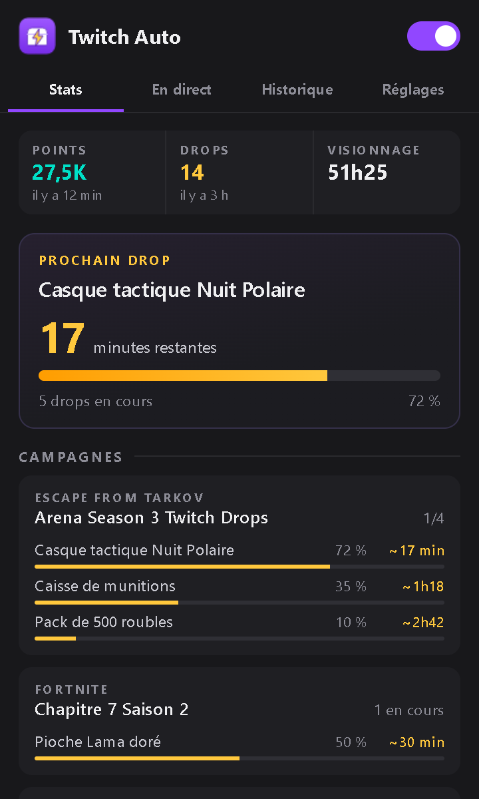

# Twitch Auto

**Francais** - [English](README.en.md)

Extension Chrome (Manifest V3) qui automatise Twitch : auto-claim des **points de chaine** et des **drops**, **farming multi-onglets** en arriere-plan, reload auto du player, et de nombreuses aides AFK. Le tout dans un popup clair a 4 onglets.

> Usage **personnel**. Extension chargee en mode developpeur (non publiee sur le Chrome Web Store).

## Fonctionnalites

- **Points de chaine** : reclame les coffres bonus automatiquement (le gain reel est comptabilise).
- **Drops** : reclamation auto via l'inventaire ET via le bandeau qui apparait sur un stream.
- **Farming multi-onglets** : les drops progressent sur TOUS les onglets ouverts en parallele (pas seulement l'onglet actif), et les videos de fond ne se mettent plus en pause.
- **Reload auto** du player en cas d'erreur (avec garde anti-boucle).
- **Qualite mini** (160p) sur les onglets en arriere-plan, meme pour un stream deja lance (bascule a chaud du lecteur), et ta qualite revient quand tu reviens sur l'onglet, y compris pour un onglet recharge ou ouvert en fond entre-temps (une video que tu mets en pause n'est jamais relancee) ; **mute** des onglets en arriere-plan (un onglet coupe a la main le reste), **anti-AFK** (gates "toujours la" / contenu sensible), **anti-pause**.
- **Alerte drop bloque** : si un drop n'avance plus depuis 30 min alors que tu regardes une chaine de SON jeu (chaine qui ne participe pas a la campagne, raid), alerte dans Stats (comptee dans la pastille d'en-tete) et notification. Une campagne laissee de cote, dont tu ne regardes pas le jeu, n'est jamais signalee.
- **Chaines participantes** : un bouton par campagne ouvre une chaine en direct qui a les drops actives pour ce jeu (meme extension coupee) ; en option ("Chaine a drops auto"), l'extension en ouvre une toute seule quand un drop est bloque (en arriere-plan, avec une notification : Chrome ne lance la video qu'une fois l'onglet affiche).
- **Fin de campagne** : quand l'inventaire donne la date de fin, chaque campagne affiche le temps qui reste, compare au temps de visionnage encore necessaire ("trop juste" en orange).
- **Suivi** : temps de visionnage, drops en cours avec % et **temps restant estime (ETA)**, stats par chaine, historique. L'onglet Stats met en avant le **prochain drop** (celui qui tombera en premier).
- **Range par jeu et par campagne** : les drops en cours sont groupes par jeu puis par campagne. L'**historique** est range **par jour** (Aujourd'hui, Hier...) avec l'heure exacte, et le jeu et la campagne de chaque drop en entier sur une deuxieme ligne.
- **Onglet "En direct"** : une carte par onglet Twitch ouvert, avec son etat reel (en direct / en pause / fige / hors-ligne / a recharger / inventaire), la qualite reellement decodee (160p, 720p...), le mute et le temps passe sur la chaine. Boutons **Aller a l'onglet**, **Recharger** (si le lecteur est fige, ou si l'onglet est "a recharger" parce que l'extension a ete rechargee depuis son ouverture) et **Fermer** ; **Tout recharger** quand plusieurs onglets sont a recharger. Apres une mise a jour, les onglets Twitch en arriere-plan sont recharges tout seuls (option "Recharge apres MAJ" ; jamais l'onglet que tu regardes, ni un onglet de fond que tu ecoutes, ni une page ou tu pourrais etre en train de saisir quelque chose : reglages, abonnement, paiement, connexion, messages). Une pastille dans l'en-tete indique le nombre d'onglets qui farment, ou le nombre d'alertes (onglets en defaut et drops bloques).
- **Notifications**, **sauvegarde** (export/import des reglages, compteurs et historique ; le fichier est filtre a l'import), **auto-MAJ**, **inventaire auto**, **auto-switch** vers une liste ordonnee de chaines de repli (5 au plus : on part sur la suivante si elle est hors ligne, jamais de retour au debut de la liste).
- **Interface bilingue (FR / EN)** : selecteur de langue a drapeaux dans l'onglet Reglages ; le popup et les notifications desktop suivent ton choix (auto-detecte depuis ton navigateur par defaut).

## Installation

1. Telecharger la derniere version : [Releases](https://github.com/Guyon-Informatique-Web/twitch-auto/releases/latest) (decompresser le ZIP), ou cloner ce depot.
2. Ouvrir `chrome://extensions`.
3. Activer le **Mode developpeur** (en haut a droite).
4. Cliquer **"Charger l'extension non empaquetee"** et selectionner le dossier de l'extension.
5. Epingler l'icone, ouvrir Twitch : c'est actif.

## Utilisation

- Clic sur l'icone -> popup a 4 onglets : **Stats** (prochain drop, compteurs, top chaines), **En direct** (etat de chaque onglet Twitch ouvert), **Historique**, **Reglages** (active/desactive chaque fonction, langue, sauvegarde).
- **Pour farmer les drops sans rien faire** : garde un onglet ouvert sur `twitch.tv/drops/inventory` **en arriere-plan**. L'extension le rafraichit toute seule et reclame les drops termines. (Ou active l'option "Inventaire auto" qui le fait pour toi.)
- Les drops progressent sur tous tes onglets de stream ouverts en parallele.

## Mises a jour

L'extension verifie automatiquement s'il existe une version plus recente et l'affiche dans le popup (banniere + bouton "Telecharger la MAJ"). Pour mettre a jour : telecharger la derniere release, remplacer le dossier, puis recharger l'extension sur `chrome://extensions`.

Grace a la cle d'ID epinglee dans le manifest, le stockage (compteurs, historique) est conserve d'une mise a jour a l'autre.

## Developpement et maintenance

- **Sans build** : HTML/CSS/JS vanilla, chargeable tel quel.
- **Tous les selecteurs Twitch** sont centralises dans `src/content/selectors.js` : c'est le seul fichier a corriger quand Twitch change son interface.
- **Tous les textes d'interface** sont centralises dans `src/shared/i18n.js` (dictionnaire FR / EN) : seul fichier a editer pour ajuster ou ajouter une traduction.
- **Diagnostic** : le bouton "Tester les selecteurs" (onglet Reglages), lance sur une page Twitch, indique ce que l'extension trouve.
- **Tests** (11 suites Node, sans dependance) : `for f in test/*.test.js; do node "$f"; done`.
- **Verification dans le vrai Chrome** (sans dependance, Google Chrome stable requis) : `node tools/verifier.js` rend chaque onglet du popup en FR et EN et cherche les debordements et erreurs ; `--live` lance un vrai stream twitch.tv (lecture, mise en sourdine en arriere-plan, chaine hors ligne) ; `--popup-reel` ouvre le vrai popup de la barre d'outils. Captures et rapport dans `tools/verif/<date>/` (non versionne).

## Licence

Usage **personnel et gratuit** autorise. Il est **interdit** de modifier, redistribuer, heberger ailleurs ou revendre ce logiciel sans accord ecrit de l'auteur. Voir [LICENSE](LICENSE). Tous droits reserves - Valentin Guyon (Guyon Informatique & Web).

## Credits

Icones : [Lucide](https://lucide.dev) / [Feather](https://feathericons.com) (licences ISC / MIT).

## Soutenir le projet

Twitch Auto est gratuit. Si l'extension t'est utile, tu peux soutenir son developpement sur Ko-fi : **[ko-fi.com/vguyondev](https://ko-fi.com/vguyondev)** &#10084;

## Avertissement

L'automatisation de Twitch (auto-claim de points/drops) est dans une zone grise des conditions d'utilisation de Twitch. Cet outil agit par simulation de clics dans la page (pas d'API privee), ce qui limite le risque, mais sans aucune garantie. Utilisation a vos propres risques.

---

Historique des versions : [CHANGELOG.md](CHANGELOG.md)
